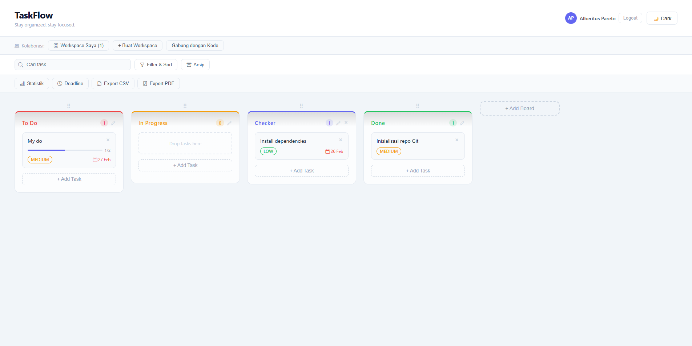
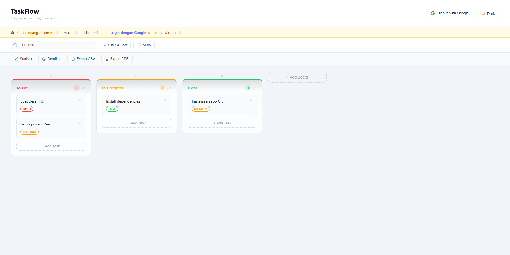
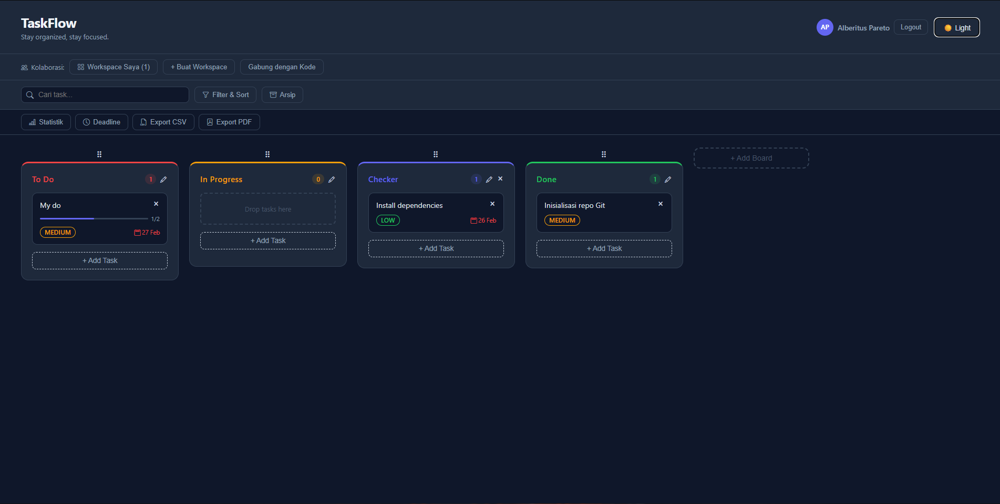
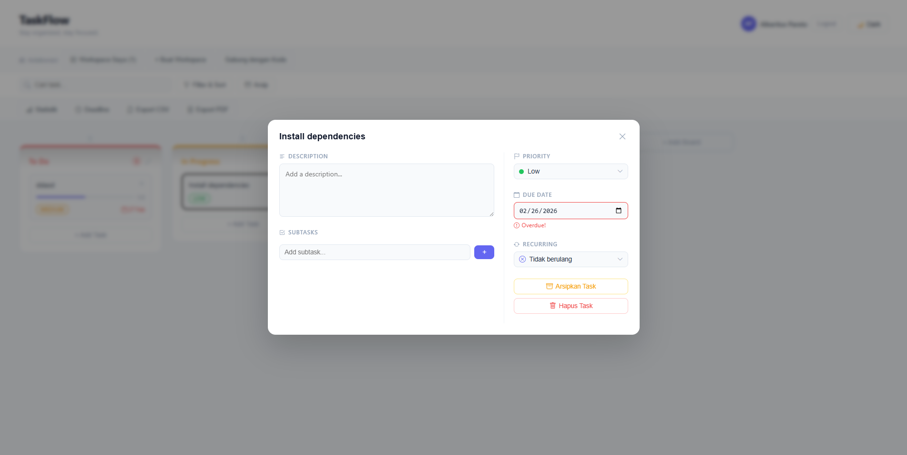
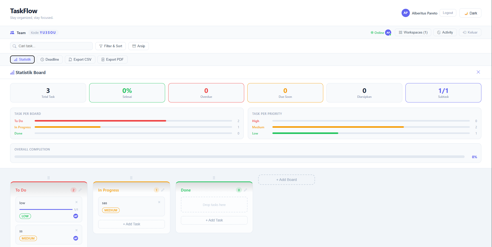
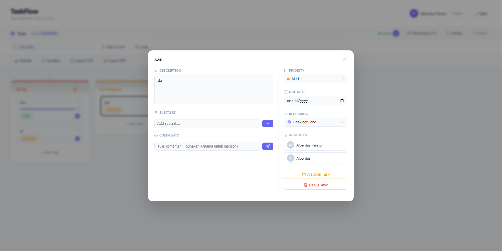

# TaskFlow 🗂️

Aplikasi **Kanban Board** modern dengan fitur drag & drop, dark mode, autentikasi Google, kolaborasi realtime, dan manajemen task lengkap.

---

## ✨ Fitur

### 📋 Task Management
- **Klik task** untuk buka Task Detail Modal
- **Edit judul** task langsung di modal
- **Deskripsi/Notes** per task
- **Due Date** dengan indikator overdue & due soon
- **Sub-task / Checklist** dengan progress bar
- **Assign task** ke member workspace
- **Priority** — High, Medium, Low dengan badge warna
- **Hapus task** dari dalam modal
- **Archive task** yang sudah done
- **Filter task** by priority / assignee
- **Search task**
- **Sort task** (by priority, by date)
- **Recurring task** (berulang tiap minggu/bulan)
- **Deadline tracking** dengan visual progress bar
- **Comment/diskusi per task**
- **Mention anggota** menggunakan @nama

### 🗂️ Board Management
- **Drag & Drop** — task dan board bisa dipindah bebas
- **Tambah board** baru dengan nama dan warna custom
- **Hapus board** (kecuali 3 board default)
- **Reorder board** via drag handle
- **Batasan urutan** — To Do tidak bisa melewati In Progress, In Progress tidak bisa melewati Done
- **Custom warna** — pilih dari 8 preset atau color picker bebas
- **Board scroll horizontal** jika kolom banyak
- **Drag task langsung ke kolom lain dengan snap**

### 👥 Kolaborasi
- **Login Google** — data tersimpan otomatis di Firebase
- **Realtime sync** — semua perubahan langsung terlihat semua member
- **Buat Workspace** — dapat kode unik 6 digit
- **Gabung Workspace** — masukkan kode dari rekan tim
- **Assign task ke member** workspace
- **Notifikasi realtime** — toast notification saat ada perubahan dari member lain
- **Lihat siapa online** — tampilkan avatar member yang sedang aktif di workspace
- **Activity log** — history semua perubahan di workspace
- **Comment/diskusi per task** — diskusi langsung di task detail modal
- **Mention anggota** — gunakan @nama di kolom komentar
- **Daftar workspace** — lihat, switch, dan kelola semua workspace yang diikuti

### 📊 Data & Produktivitas
- **Statistik progress** (task done, in progress, dll)
- **Export board** PDF atau CSV

### 🎨 UI/UX
- **Dark Mode** — toggle light/dark kapan saja
- **Mode Tamu** — bisa dipakai tanpa login (data tidak tersimpan)
- **Custom dropdown** priority bergaya Select2
- **Avatar inisial** dari nama akun Google
- **Responsive** — support mobile
- **Responsive mobile yang lebih baik**
- **Animasi transisi lebih smooth**
- **Keyboard shortcu**

---

## 🖼️ Screenshots

### 🔐 Login


### 👤 Mode Tamu


### 🌙 Dark Mode


### 🗂️ Board & Task


### 👥 Workspace


### 💬 Modal Workspace


---

## 🛠️ Tech Stack

| Teknologi | Kegunaan |
|-----------|----------|
| React + Vite | Frontend framework |
| @dnd-kit | Drag & drop |
| Firebase Auth | Login dengan Google |
| Firestore | Database realtime |
| Bootstrap Icons | Icon library |

---

## 🚀 Cara Menjalankan

### 1. Masuk ke folder project

```bash
cd todo-list
```

### 2. Install dependencies

```bash
npm install
```

## 3. Setup environment variables

1. Buat file `.env` di root project (sejajar dengan `package.json`)
2. Isi dengan konfigurasi Firebase kamu:
```env
VITE_FIREBASE_API_KEY=your_api_key
VITE_FIREBASE_AUTH_DOMAIN=your_project.firebaseapp.com
VITE_FIREBASE_PROJECT_ID=your_project_id
VITE_FIREBASE_STORAGE_BUCKET=your_project.firebasestorage.app
VITE_FIREBASE_MESSAGING_SENDER_ID=your_sender_id
VITE_FIREBASE_APP_ID=your_app_id
VITE_FIREBASE_MEASUREMENT_ID=your_measurement_id
```
Tersedia file `.env.example` sebagai template — copy dan isi dengan nilai dari Firebase Console kamu.

### 4. Jalankan dev server

```bash
npm run dev
```

Buka [http://localhost:5173](http://localhost:5173) di browser.

---

## 📁 Struktur Folder

```
src/
├── components/
│   ├── ActivityLog.jsx       # Panel history perubahan
│   ├── AddTaskForm.jsx       # Form tambah task dengan custom dropdown
│   ├── ArchivePanel.jsx      # Panel arsip task
│   ├── Board.jsx             # Container utama drag & drop
│   ├── BoardToolbar.jsx      # Toolbar filter, search, dan aksi board
│   ├── Column.jsx            # Kolom/board individual
│   ├── DeadlineTracker.jsx   # Tracker deadline task
│   ├── NotificationToast.jsx # Toast notifikasi realtime
│   ├── OnlinePresence.jsx    # Tampilkan member yang sedang online
│   ├── ShortcutHint.jsx      # Hint keyboard shortcut
│   ├── SortableColumn.jsx    # Wrapper drag kolom
│   ├── StatsPanel.jsx        # Panel statistik board
│   ├── TaskCard.jsx          # Card task dengan preview info
│   ├── TaskDetailModal.jsx   # Modal detail task (edit, subtask, assignee, dll)
│   └── WorkspacePanel.jsx    # Panel kolaborasi workspace
├── data/
│   └── initialData.js        # Data awal kolom & task
├── hooks/
│   ├── useActivity.js        # Logic activity log
│   ├── useAuth.js            # Logic autentikasi Google
│   ├── useComments.js        # Logic comment per task
│   ├── useExport.js          # Logic export data
│   ├── useKeyboardShortcuts.js # Logic keyboard shortcuts
│   ├── useNotifications.js   # Logic notifikasi realtime
│   ├── usePresence.js        # Logic online presence
│   ├── useRecurring.js       # Logic task berulang
│   ├── useTasks.js           # Logic task & kolom + Firestore sync
│   └── useWorkspace.js       # Logic buat, gabung & daftar workspace
├── firebase.js               # Konfigurasi Firebase
├── App.jsx                   # Root component
└── App.css                   # Global styles
```

---

## 🔥 Konfigurasi Firebase

1. Buat project di [Firebase Console](https://console.firebase.google.com)
2. Aktifkan **Authentication → Google**
3. Buat **Firestore Database** (test mode → region asia-southeast1)
4. Copy konfigurasi ke `src/firebase.js`

### Firestore Rules

```
rules_version = '2';
service cloud.firestore {
  match /databases/{database}/documents {

    match /users/{userId}/{document=**} {
      allow read, write: if request.auth != null && request.auth.uid == userId;
    }

    match /workspaces/{workspaceId} {
      allow read: if request.auth != null;
      allow create: if request.auth != null;
      allow update: if request.auth != null && (
        resource.data.ownerId == request.auth.uid ||
        request.resource.data.diff(resource.data).affectedKeys().hasOnly(['members', 'memberNames'])
      );
      allow delete: if request.auth != null && resource.data.ownerId == request.auth.uid;

      match /columns/{colId} {
        allow read, write: if request.auth != null &&
          get(/databases/$(database)/documents/workspaces/$(workspaceId)).data.members[request.auth.uid] == true;
      }
      match /tasks/{taskId} {
        allow read, write: if request.auth != null &&
          get(/databases/$(database)/documents/workspaces/$(workspaceId)).data.members[request.auth.uid] == true;
      }
      match /presence/{userId} {
        allow read: if request.auth != null &&
          get(/databases/$(database)/documents/workspaces/$(workspaceId)).data.members[request.auth.uid] == true;
        allow write: if request.auth != null && request.auth.uid == userId;
      }
      match /activity/{activityId} {
        allow read: if request.auth != null &&
          get(/databases/$(database)/documents/workspaces/$(workspaceId)).data.members[request.auth.uid] == true;
        allow create: if request.auth != null &&
          get(/databases/$(database)/documents/workspaces/$(workspaceId)).data.members[request.auth.uid] == true;
      }
      match /tasks/{taskId}/comments/{commentId} {
        allow read, write: if request.auth != null &&
          get(/databases/$(database)/documents/workspaces/$(workspaceId)).data.members[request.auth.uid] == true;
      }
    }
  }
}
```

---

## 👥 Cara Kolaborasi Realtime

1. Login dengan akun Google
2. Klik **+ Buat Workspace** → isi nama workspace
3. Bagikan **kode 6 digit** yang muncul ke rekan tim
4. Rekan tim login → klik **Gabung dengan Kode** → masukkan kode
5. Semua perubahan **sync realtime** ke seluruh member ✅
6. Di dalam workspace, bisa **assign task** ke member manapun
7. Klik **Activity** untuk lihat history perubahan
8. Avatar member yang online tampil di workspace bar

---

## 📝 Cara Pakai Task Detail

1. Klik task card manapun untuk buka modal
2. Edit judul langsung di bagian atas modal
3. Tambah deskripsi/notes di kolom kiri
4. Tambah subtask dengan checklist dan progress bar
5. Set due date — otomatis muncul warning kalau overdue atau hampir deadline
6. Assign ke member workspace (kolom kanan)
7. Ubah priority dengan dropdown custom
8. Tulis komentar — gunakan @nama untuk mention member
9. Hapus task via tombol merah di bawah

---

## 📦 Scripts

```bash
npm run dev      # Jalankan development server
npm run build    # Build untuk production
npm run preview  # Preview hasil build
```

---

## 📄 Lisensi

MIT License — bebas digunakan dan dimodifikasi.
